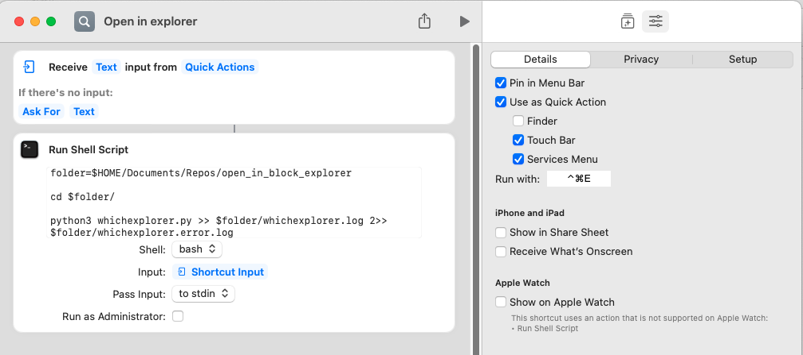
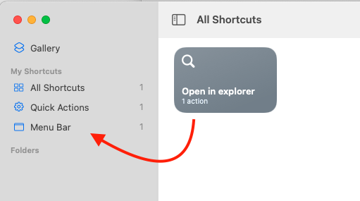

# open_in_block_explorer

> Fed up of having to open 3 tabs of etherscan, data.elliptic (etc.) for your crypto addresses? This code will determine the type of coin and go create a tab for that address.

## Pros
- Speeds up monotonous opening of tabs.

## Cons
- Pattern matching isn't perfect (is using regex), resulting in some addresses being opened on NEAR explorer as a catch-all.
- Cells in spreadsheets on chrome don't flow into the shortcut well. Best is a `ctrl+c` and then pasting when the prompt appears.

## Prerequisites 
- macOS 12 (Monterey)
- shortcups.app (Comes installed on Monterey)

## Installation
1. Clone this repo to a directory of your choice `<dir>`
2. Open up shortcuts.app and create a new blank shortcut.
3. Add the block "Run Shell Script" into the workflow, with the contents of the shell script being a copy-paste of `run.sh`.
4. Set the shortcut to receive text from quick actions, if there's no input ask for text.
5. Set the shell script input to `stdin`.
6. Set your keyboard shortcut and optional finder, touch bar tick-boxes.

The shortcut panel should look something like this:

To have the shortcut in your menu bar up at the top, simply drag the shortcut into the folder of menu bar:

## Configuration
The python dictionary of `PREFERENCES` sets for which coin, which explorer you would want to open. Changing this per coin will have the config you so desire.

## Contribute
Please help improve this and submit a PR!